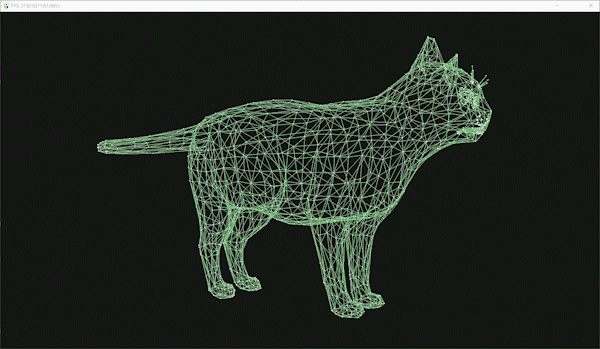

<h1>Python object renderer example using pygame</h1>

<p>This is a simple example of how to render a 3D object in python using pygame</p>

<h3>setup:</h3>

```
$ pip install pygame
```
```
$ python main.py
```



Based on the tutorial by Coder Space at https://www.youtube.com/watch?v=M_Hx0g5vFko